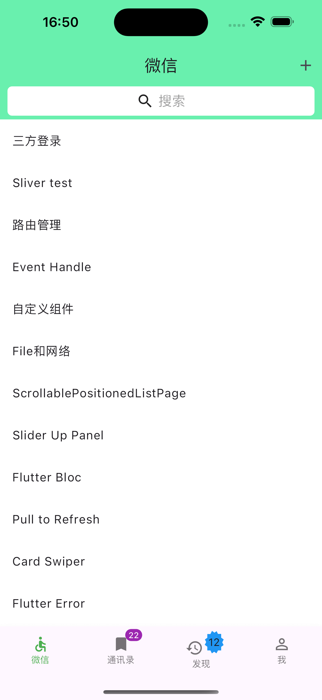
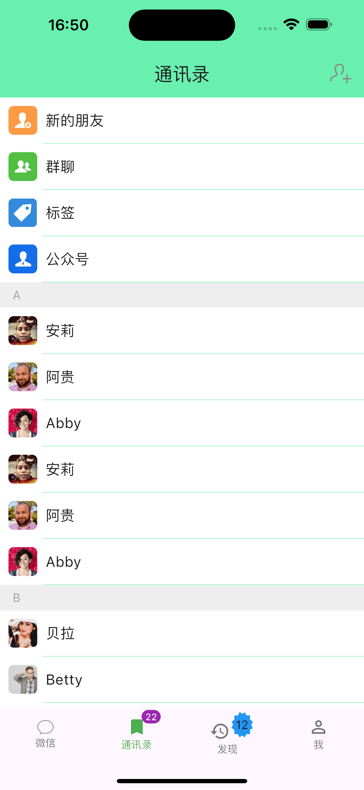
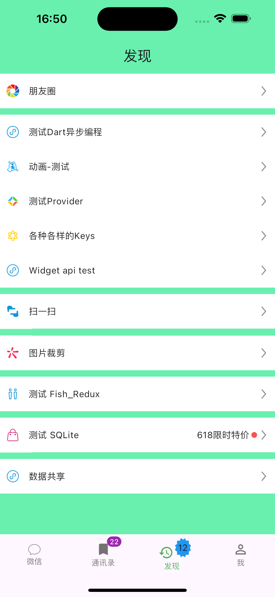

# Object

仿制微信主页面的Flutter Demo.

This project is a Demo for learning Flutter.

内容主要包含 相关Flutter 技术的学习和演示.

Demo 中为了演练，穿插使用了2种状态管理lib, Provider and GetX， 也有单纯使用 StatefulWidget +
Flutter原有Navigator,
正式项目建议选择其中一种，统一管理应用。

## flutter --version

Current Version：

```
Flutter 3.22.3 • channel stable • https://github.com/flutter/flutter.git
Framework • revision b0850beeb2 (3 months ago) • 2024-07-16 21:43:41 -0700
Engine • revision 235db911ba
Tools • Dart 3.4.4 • DevTools 2.34.3

`ps: 2024-10-24 update to Flutter 3.22.3  `

已经升级到 Flutter 3.32.8 

Flutter 3.32.8 • channel stable • https://github.com/flutter/flutter.git
Framework • revision edada7c56e (2 months ago) • 2025-07-25 14:08:03 +0000
Engine • revision ef0cd00091 (2 months ago) • 2025-07-24 12:23:50 -0700
Tools • Dart 3.8.1 • DevTools 2.45.1

```

`ps: 本Demo大约2023-8月，当前Demo 从2.x 升级到 Flutter 3.x`

## Flutter Skill list

This part is based on the `lib` file

* Animation
* Async Test
* Base base_view and base on getX's base_view
* Common setting
* Const value setting
* CustomWidget widget组合，Custom， Use CustomPaint Canvas，RenderObject
* Dart test
* Error test
* Event 事件处理
* File and Network -> File IO, HttpClient, Dio and WebSocket
* Generated for 国际化，包括 `l10n` file
* Image crop 裁剪
* Inherited Widget
* Interview test
* Json Model 生成
* Key Test
* Models -> 使用过JsonModel 由json file 自动生成的models
* Page Route 路由机制
* Pages -> 主页root_page 和 各项首页
* Lib Provider use
* Signature 画签名
* Sliver Widget -> ListView, AnimatedListView,PageView,ScrollController
* Sqlite use
* Async and Sync test
* Widgets -> common widget
* Widgets test `1：Stream StreamBuild  2：FutureBuilder 3：LayoutBuilder 4：Flexible 5：GridView`
* main

## Main page

* Pages -> 主页root_page 和 各项首页

<table>
<tr>
<td> </td>
<td> </td>
<td> </td>

</tr>

</table>

## Good Libs

* [flutter_native_splash](https://pub-web.flutter-io.cn/packages/flutter_native_splash)
* [flutter_launcher_icons](https://pub-web.flutter-io.cn/packages/flutter_launcher_icons)
* [easy_debounce](https://pub-web.flutter-io.cn/packages/easy_debounce) 防抖 and 节流
* [scrollable_positioned_list](https://pub-web.flutter-io.cn/packages/scrollable_positioned_list)
* [sliding_up_panel](https://pub-web.flutter-io.cn/packages/sliding_up_panel)
* [flutter_bloc](https://pub-web.flutter-io.cn/packages/flutter_bloc)
* [flutter_bloc使用解析](https://juejin.cn/post/6856268776510504968#heading-16)
* [pull_to_refresh](https://github.com/peng8350/flutter_pulltorefresh/blob/master/README_CN.md)
* [card_swiper](https://pub-web.flutter-io.cn/packages/card_swiper)
* [flutter_staggered_grid_view 瀑布流布局](https://pub-web.flutter-io.cn/packages/flutter_staggered_grid_view)


